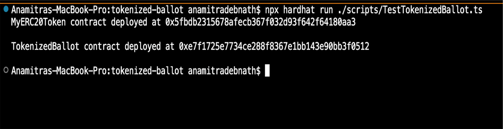
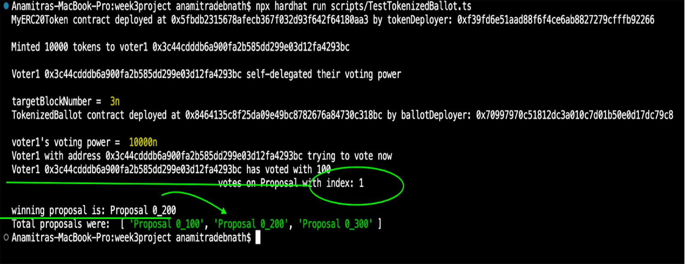

# Week 3 Project - Group No. 5

## Index
- [Assignment Overview](#assignment-overview)
- [Date of Submission](#date-of-submission)
- [GitHub Link](#github-link)
- [Tasks](#tasks)
  - [Complete TokenizedBallot.sol Smart Contract](#complete-tokenizedballotsol-smart-contract)
  - [Successfully Deploying MyERC20Token and TokenizedBallot](#successfully-deploying-myerc20token-and-tokenizedballot)
  - [Voting for a Proposal](#voting-for-a-proposal)
  - [Winning Proposal](#winning-proposal)

## Assignment Overview
This is a group activity for at least 3 students:

- Complete the contracts together.
- Develop and run scripts for `TokenizedBallot.sol` within your group to give voting tokens, delegate voting power, cast votes, check vote power, and query results.
- Write a report with each function execution and the transaction hash, if successful, or the revert reason, if failed.
- Submit your weekend project by filling the form provided in Discord.
- Share your code in a GitHub repo in the submission form.

## Date of Submission
- August 2024

## GitHub Link
[Project Repository](https://github.com/evmbootcamp/week3project)

## Tasks

### Complete TokenizedBallot.sol Smart Contract
- Status: Completed. Code available on GitHub.

### Successfully Deploying MyERC20Token and TokenizedBallot
- Status: Successfully deployed both `MyERC20Token` (aka "MyToken") and `TokenizedBallot`.
  

### Voting for a Proposal

- **Issue:** Script failing when user votes without enough voting power.
  
- **Success:** Voter mints tokens, self-delegates, and votes for a proposal.
  

### Winning Proposal
- Status: Successfully retrieved the correct winning proposal.
  
